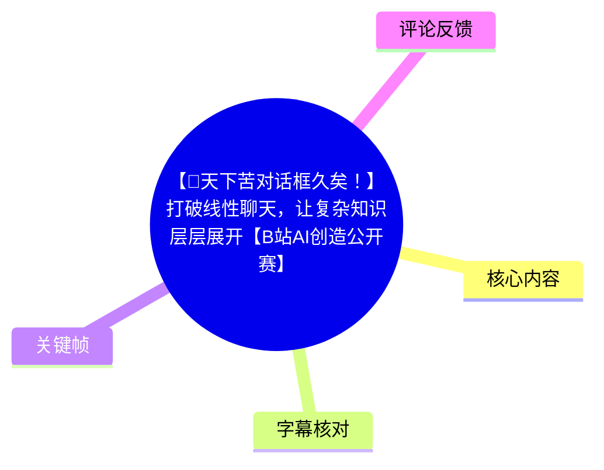
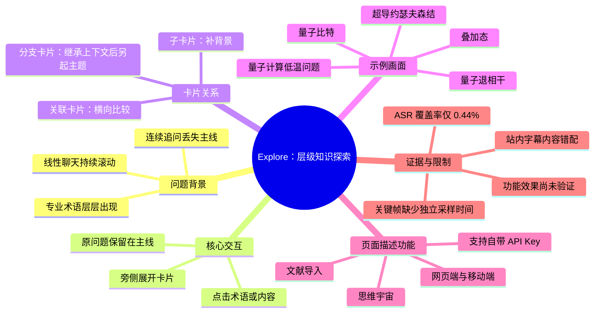
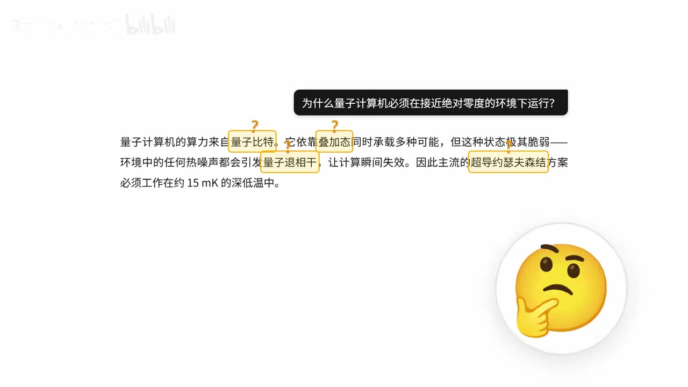
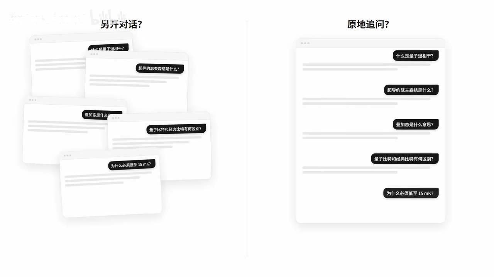

# 【🤯天下苦对话框久矣！】打破线性聊天，让复杂知识层层展开【B站AI创造公开赛】

> 来源：[Bilibili 视频](https://www.bilibili.com/video/BV11mNA6vEJX) 
> UP 主：Explore_Official｜视频时长：60 秒｜合集：AIcode 
> 页面描述所列产品入口：[ai.explore.poker](https://ai.explore.poker)

## 小结

视频及其页面描述聚焦于 **Explore**：一个试图以“层级对话（Hierarchical Dialogue）”替代传统线性 AI 聊天框的知识探索工具。它针对的核心痛点是：在阅读论文、学习生物或量子计算等复杂主题时，用户连续追问术语会使对话不断向下滚动，原始问题、上下文和不同分支之间的关系难以保留。

关键帧展示的交互逻辑是：在 AI 回答中直接点击不理解的术语或句子，在原内容旁展开新的解释卡片，而不是另开会话或在原聊天流中继续追问。画面以“量子计算机为什么必须在接近绝对零度的环境下运行？”为例，将“量子比特”“叠加态”“量子退相干”“超导约瑟夫森结”等可继续追问的概念框出。

页面描述将卡片关系划分为三类：**子卡片**用于向下补充背景知识，**关联卡片**用于横向比较或发散，**分支卡片**用于继承上下文后另起主题。其宣称的价值不在于替 AI 直接给出答案，而在于让用户把探索过程保留为可见的知识树；该定位适合需要反复拆解概念关系的学习者、研究者与创作者。

页面描述还提及“思维宇宙”：用户以自己的话总结某项内容、经 AI 认可后，理解会被存入个人 3D 知识网络。这里属于产品方的功能介绍与愿景，现有 60 秒视频素材及关键帧不足以验证其实际评估机制、3D 网络呈现、长期记忆效果或教学准确性。

需要特别注意素材可靠性：站内字幕的内容是关于脱口秀现场争议的新闻，与视频标题、UP 主描述和所给关键帧中的 Explore 产品演示完全不一致；本次 ASR 也只在 00:03.630–00:03.890 识别到英文 “Thank you.”。因此，本文不会把站内字幕的新闻叙述当作本视频事实，而是以标题、页面描述和关键帧可见文字为主进行整理，并明确标注证据边界。

## 思维导图

## 目录

- [素材概况与问题定义](#素材概况与问题定义-0000)
- [画面中的层级对话示例](#画面中的层级对话示例-0003)
- [从线性追问到卡片化展开](#从线性追问到卡片化展开-0000)
- [产品功能、使用步骤与参数](#产品功能使用步骤与参数-0000)
- [适用范围、限制与时效性](#适用范围限制与时效性-0000)
- [字幕比对与内容校正](#字幕比对与内容校正-0000)
- [评论分析](#评论分析-0000)
- [处理记录](#处理记录-0000)

## 素材概况与问题定义 [00:00](https://www.bilibili.com/video/BV11mNA6vEJX?t=0)

视频标题直接提出“打破线性聊天，让复杂知识层层展开”。UP 主页面描述将传统聊天框的问题概括为以下过程：

1. 用户先提出一个问题；
2. AI 的回答中出现多个不理解的专业术语；
3. 用户继续追问其中一个术语；
4. 新回答又带来更多术语；
5. 经多轮追问后，原始问题和先前上下文被淹没在连续消息流中。

这个问题本质上不是单纯的“回答质量”问题，而是**探索路径的空间组织**问题：线性消息流天然按时间堆叠，不擅长同时展示主问题、多个子问题、横向对比和不同思路的分叉。

关键帧中的示例问题为：

> 为什么量子计算机必须在接近绝对零度的环境下运行？

画面中的回答文本将低温运行与以下概念关联：量子比特、叠加态、量子退相干，以及超导约瑟夫森结方案约需约 **15 mK** 的深低温环境。这里的数值和概念仅作为画面中的示例信息，不应据此延伸为对所有量子计算硬件路线的统一结论。

> 图：画面把“量子比特”“叠加态”“量子退相干”“超导约瑟夫森结”等词以黄色框标为可展开对象，直观说明产品意图：让术语解释附着于原回答，而非在聊天记录中不断下沉。该帧是理解产品问题定义与交互目标的核心证据。

## 画面中的层级对话示例 [00:03](https://www.bilibili.com/video/BV11mNA6vEJX?t=3)

> 时间说明：本次 ASR 唯一可用的真实时间分段为 00:03.630–00:03.890；该段仅识别出 “Thank you.”，不能为画面中的具体操作建立完整口述时间轴。本节时间链接据该 ASR 的起点设置，正文内容依据关键帧可见画面与页面描述。

### 以原问题为中心，点击概念展开

画面采用量子计算低温运行问题作为主卡片内容。回答中出现的多个概念被分别标记，意味着用户可将“我不理解的部分”定位到某一个局部，而不必重新组织一整句追问。

从页面描述可归纳的预期交互是：

- 对不理解的术语或片段直接点击；
- 系统在相邻位置展开一张新卡片；
- 原始回答留在当前视野内；
- 用户可继续在新卡片上向下探索。

这是一种以**问题之间的父子关系**替代以**消息先后顺序**为主的组织方式。它试图解决的不是“减少问题数量”，而是让问题增多时仍能辨认每个问题从哪里派生。

### 同一主题下的多分支展开

对比画面把两种方式并置：

- 左侧“另开对话？”：围绕量子退相干、超导约瑟夫森结、叠加态、量子比特与经典比特的差异、15 mK 的原因等问题，形成多张彼此重叠的独立窗口；
- 右侧“原地追问？”：问题仍位于一条长对话内，后发问题逐层向下排列。

该画面对传统方案的批评是：另开会话会使关联散落，原地追问会使主线被新消息覆盖。Explore 所主张的替代方案，是将这些追问按关系排列到原内容周围。

> 图：左侧展示多窗口分散带来的关系断裂，右侧展示线性追问造成的消息堆叠。该帧明确呈现了视频的主要论点：复杂学习任务需要保留问题的层级与并列关系。

### 对复杂主题的实际含义

以画面中的量子计算问题为例，较合理的探索树可被抽象为：

- 主问题：为什么要在接近绝对零度下运行？
  - 概念一：量子比特是什么？
  - 概念二：叠加态是什么意思？
  - 概念三：热噪声为何会影响量子态？
    - 延伸：量子退相干是什么？
  - 概念四：超导约瑟夫森结属于什么硬件方案？
  - 横向问题：量子比特与经典比特有何区别？
  - 参数问题：约 15 mK 指什么、适用于什么方案？

其中，“约 15 mK”是关键帧文字中出现的参数；而这棵树的具体层级布局是基于画面与产品描述所作的整理，不是视频中逐项演示的操作录像。

## 从线性追问到卡片化展开 [00:00](https://www.bilibili.com/video/BV11mNA6vEJX?t=0)

### 交互模型：主卡片与局部展开

页面描述把核心机制称为“层级对话（Hierarchical Dialogue）”，并以“哪里不懂点哪里”概括其使用方式。可以将其理解为以下结构：

| 层级元素 | 作用 | 相比线性聊天的变化 |
| --- | --- | --- |
| 主卡片 | 承载原始问题与初始回答 | 原始目标不会因后续追问而从视野中消失 |
| 子卡片 | 解释某个术语或背景知识 | 将“为什么”“是什么”等细化问题挂回来源 |
| 关联卡片 | 用于比较、类比或横向发散 | 可保留并列关系，而非强行排成下一条消息 |
| 分支卡片 | 在继承已有上下文的基础上另起炉灶 | 可探索新方向，同时保留其与源内容的关系 |

上述“子卡片 / 关联卡片 / 分支卡片”的定义来自页面描述。视频关键帧能直接支持“术语可点击、解释可局部展开”的交互意图，但无法独立验证每一类卡片在实际产品中的完整视觉样式、创建条件或上下文传递规则。

### 常规聊天界面的起始状态

所给关键帧中还出现深色界面：中央底部为文本输入框，包含 `Auto` 下拉项、语言/网络样式图标、附件图标和绿色发送按钮；右侧有表情图标。该画面可视作产品从提问开始的界面状态。

> 图：该帧展示了底部输入栏、`Auto` 状态和附件入口，是正文中“从问题输入到内容展开”流程的起点证据。画面没有展示下拉菜单内容，因此不能据此断言 `Auto` 对应的具体模型、语言或推理模式。

### 信息架构带来的经验

对需要处理长链条知识的问题，卡片化结构有三项可迁移价值：

1. **保留来源**：每一个追问都能回溯到触发它的术语、句子或问题。
2. **允许并行**：不必在“先弄懂 A 再问 B”与“新开会话导致散乱”之间二选一。
3. **降低复述成本**：当分支继承上下文时，用户理论上不必在每次新问题中重复粘贴原始材料。

但这些价值依赖实现：如果卡片过多、布局缺少折叠和导航、上下文继承不透明，树形界面也可能转化为新的认知负担。视频素材未展示大规模卡片管理、搜索、导出、删除、折叠或引用溯源机制，不能据此判断其在长期项目中的可用性。

## 产品功能、使用步骤与参数 [00:00](https://www.bilibili.com/video/BV11mNA6vEJX?t=0)

### 可从页面描述确认的功能

页面描述明确提到的能力如下：

| 功能 | 页面描述中的定位 | 证据状态 |
| --- | --- | --- |
| 层级对话 | 点击不理解的内容，在旁侧展开新卡片 | 关键帧与描述均支持 |
| 子卡片 | 深挖背景知识 | 页面描述支持 |
| 关联卡片 | 横向对比、发散 | 页面描述支持 |
| 分支卡片 | 继承上下文并另起主题 | 页面描述支持 |
| 文献导入 | 对导入文献获得“哪里不懂点哪里”的体验 | 页面描述支持；未见操作演示 |
| 网页端与移动端 | 均已上线 | 页面描述声明；未在素材中验证版本与功能一致性 |
| 自带 API Key | 支持用户自行提供 API Key | 页面描述声明；未提供供应商、加密、计费或权限细节 |
| 主题颜色 | 建议选择喜欢的颜色主题 | 页面描述声明 |
| 思维宇宙 | 用户总结被 AI 认可后存入个人 3D 知识网络 | 页面描述声明；未见效果演示 |

### 基于已知信息的使用流程

以下流程只整理页面描述与画面已经支持的步骤，不补写未展示的按钮路径或配置字段：

1. **进入产品**
   - 访问页面描述提供的入口：`https://ai.explore.poker`。
   - 页面描述称网页端和移动端均已上线；具体兼容平台、登录机制与版本差异未提供。

2. **提出主问题或导入材料**
   - 在输入框中输入希望探索的主问题。
   - 页面描述称支持导入文献，但未提供文件格式、大小限制、解析质量与隐私处理说明。

3. **阅读初始回答并定位不理解处**
   - 在回答中识别陌生术语、关键论断或值得比较的观点。
   - 画面中的量子计算示例将“量子比特”“叠加态”等词作为局部追问入口。

4. **选择合适的展开关系**
   - 若需要定义、原理、前置知识：使用子卡片式的向下展开；
   - 若需要差异、类比或替代方案：使用关联卡片式的横向展开；
   - 若要沿已有材料转向新议题：使用分支卡片式的上下文继承。

5. **维护主线**
   - 将主问题作为根节点；
   - 对每张卡片只处理一个明确子问题；
   - 对会影响结论的参数、限定条件、来源要求单独开卡，避免把定义、证据和推断混在同一层。

6. **沉淀个人理解（页面描述功能）**
   - 页面描述称，用户可以用自己的话总结内容；
   - 若 AI “认可”，理解将被存入“思维宇宙”。
   - “认可”的评价标准、是否支持人工修订、误判处理与数据可迁移性均未说明。

### 已出现的参数与未出现的参数

**已直接出现：**

- 视频总时长：60 秒；
- ASR 输入音频时长：59.4346875 秒；
- ASR 检出的有效语音：0.26 秒；
- ASR 语音覆盖率：0.0044，即约 **0.44%**；
- 关键帧量子计算示例文字：约 **15 mK** 深低温环境；
- 输入界面可见 `Auto` 标记，但未见其下拉选项或含义。

**未提供、不可编造：**

- 支持哪些具体大模型或 API 服务商；
- API Key 的配置格式、保存位置、加密方式、是否会上传至服务端；
- 免费额度、订阅价格、调用费用与速率限制；
- 文献导入的格式、大小、OCR 能力与引用准确性；
- 卡片最大数量、树深度、数据导出和协作能力；
- “思维宇宙”中 AI 认可总结的评判标准与数据使用政策。

## 适用范围、限制与时效性 [00:00](https://www.bilibili.com/video/BV11mNA6vEJX?t=0)

### 适用场景

按页面描述的定位，以下场景与该交互模式较匹配：

- **论文阅读与科研学习**：把术语、方法、实验条件、反例和关联工作分层拆开；
- **理工科概念学习**：例如画面中的量子计算主题，可将硬件、物理机制、参数与比较问题分开；
- **跨学科自学**：当一个解释会引出许多前置概念时，用子卡片保留依赖关系；
- **创作与设计发散**：将主创意、参考案例、角色设定、情节分支等平行保存。

### 使用风险与核验建议

1. **结构不能替代事实核验**  
   卡片能保存问题关系，不代表其中 AI 回答自动可靠。尤其是医学、法律、金融、科研结论和技术参数，仍应对原始论文、官方文档或权威资料进行核查。

2. **API Key 需关注安全边界**  
   页面描述称支持自带 API Key，但未披露密钥如何保存、是否加密、请求发送至何处、是否记录日志。使用前应阅读实际产品的隐私政策、服务条款与密钥管理说明，避免将高权限或生产环境密钥直接用于未核验服务。

3. **“上下文继承”可能放大错误前提**  
   若主卡片的初始理解有误，后续继承上下文的分支可能在错误前提上继续扩展。重要结论应建立独立验证节点，而不是仅依赖同一上下文链。

4. **大规模树可能产生新复杂度**  
   分支过多时，用户仍需依赖命名、折叠、检索、标签或总结机制。视频没有展示这些管理能力，实际体验需在产品中验证。

### 时效性

视频元数据抓取时间为 **2026-08-07**，页面描述称产品网页端与移动端“均已上线”，并提供了访问地址与功能宣称。AI 产品的模型支持、价格、可用地区、移动端能力、API Key 政策及隐私条款都可能快速变化；本文仅记录当前提供素材中的陈述，不将其视为长期有效承诺。

## 字幕比对与内容校正 [00:00](https://www.bilibili.com/video/BV11mNA6vEJX?t=0)

### 对比结论

| 字幕来源 | 完整性 | 专有名词 | 时间轴 | 主要问题 |
| --- | --- | --- | --- | --- |
| Bilibili 站内字幕 `p01-ai-zh.srt` | 覆盖 00:00.080–00:00.053.800，形式上较完整 | 含“杨幂”“上海”“脱口秀”等词，但均与本视频主题无关 | 分段时间连续、可用 | 内容讲述脱口秀演员称呼观众“大姐”引发争议，与 Explore 产品标题、描述、关键帧完全错配 |
| 本次 ASR `large-v3-turbo` | 极低：仅 1 句、0.26 秒语音 | 仅识别英文 “Thank you.” | 00:03.630–00:03.890 为有效真实分段 | 识别语言为英语，语言置信度 0.310546875；覆盖率仅 0.44%，无法还原视频正文 |
| 关键帧与页面描述 | 可支持产品主题、量子计算示例和部分功能宣称 | 可读出“量子比特”“叠加态”“量子退相干”“超导约瑟夫森结”“Auto”等 | 关键帧文件未附带采样秒数 | 能补足语义，不能提供每项画面内容的精确出现时间 |

### 最终字幕与证据选择

- **未采用站内字幕的语义内容**：虽然其 SRT 时间轴完整，但叙述对象与本视频显著不符，属于错配素材，不能作为 Explore 视频的转写依据。
- **已检查并保留本次 ASR 结果**：ASR 结果未标记 `noAudioStream=true`，因此不能称源视频无音轨；实际诊断显示存在音频文件和极少量可识别语音，但 ASR 仅转出 “Thank you.”，不足以支撑正文。
- **正文采用的证据优先级**：视频标题与页面描述 → 关键帧可见文字和界面 → ASR 的唯一真实时间段。  
- **时间轴处理原则**：章节链接只使用提供的真实 SRT/ASR 分段起点；对于无法由字幕可靠定位的界面与功能内容，不虚构精确出现秒数。本文出现的 `t=0` 为站内 SRT 的真实起点，不表示认可该字幕的语义；`t=3` 对应本次 ASR 唯一语音段的起点附近。

### 通过画面校正的关键内容

以下内容来自关键帧可见文字，而非错配的站内字幕：

- 主问题：“为什么量子计算机必须在接近绝对零度的环境下运行？”
- 可展开概念：量子比特、叠加态、量子退相干、超导约瑟夫森结；
- 示例参数：约 15 mK；
- 对比标题：“另开对话？”与“原地追问？”；
- 输入界面状态：`Auto`。

## 评论分析 [00:00](https://www.bilibili.com/video/BV11mNA6vEJX?t=0)

仅处理可获取的热评前三条；评论属于用户观点，不构成对产品功能、原创性或技术实现的验证。

| 排名 | 用户 | 获赞 | 评论要点 | 分析 |
| --- | --- | ---: | --- | --- |
| 1 | 这句话是不是a | 1325 | “跟我撞点子了……然而我还没做完，这年头创意真不值钱了” | 评论者以玩笑式口吻表示，自己曾有相近想法但尚未完成。它反映“层级化知识/对话界面”并非只有单一团队会想到的方向，但未给出作品、时间线或实现细节，不能据此判断原创性归属。 |
| 2 | JIEYUSAMA | 79 | 与排名第一评论几乎相同，使用拼音替代部分汉字 | 内容与第一条高度重复，可能是在玩同一“撞点子”梗；没有补充可核验信息。 |
| 3 | 打不了字 | 79 | “绕了一圈又回去了？这不就是最初HTML想要达到的效果吗” | 评论将产品的非线性、链接式知识组织联想到 HTML/超文本的早期理念。这是有启发性的类比：超文本强调节点与链接，产品则试图把对话生成的内容组织为可分支节点；但它是概念层面的评论，不能证明产品技术路线、实现方式或历史继承关系。 |

评论区最显著的反馈集中在两点：一是对“创意撞车”的调侃，二是将层级对话视为超文本理念在 AI 对话中的再应用。两者都未涉及 API Key 安全、模型质量、文献解析准确度或长期知识管理效果，因此不能替代实际试用与技术评估。

## 处理记录 [00:00](https://www.bilibili.com/video/BV11mNA6vEJX?t=0)

- Worker ID：`worker-msiy1nhz-a9a1eb29`
- 整理模型：`gpt-5.6-terra`
- ASR 模型：`large-v3-turbo`
- 已使用素材与工具产物：
  - 视频元数据与页面描述；
  - 站内字幕：`subtitles/p01-ai-zh.srt`；
  - 本次 ASR：`asr/asr-result.json`、`asr/transcript.srt`、`asr/asr-transcript.txt`；
  - 关键帧目录：`frames/`；
  - 热评数据：`comments/comments.json`，可获取数量为 3 条。
- 字幕选择：
  - 已检查站内字幕与本次 ASR；
  - 站内字幕时间轴存在，但文本主题与视频严重错配，未用于正文事实；
  - ASR 未标记 `noAudioStream=true`，说明不能认定视频无音轨；但其语音覆盖率仅 0.44%，仅有 “Thank you.”，不适合作为主字幕；
  - 正文改以标题、页面描述和关键帧多模态信息为主要证据，并保留时间轴证据边界。
- 关键帧选择依据：
  - `frames/frame-001.jpg`：展示量子计算问题、可点击术语和约 15 mK 示例参数；
  - `frames/frame-002.jpg`：直接展示“另开对话”与“原地追问”的问题对比；
  - `frames/frame-004.jpg`：展示深色输入界面及可见 `Auto`、附件、发送入口；
  - 其他提供关键帧中存在与 `frame-001.jpg` 内容相近的重复画面，未重复插入。
- 缓存清理：本次仅依据任务已提供的素材清单生成文档；未执行本地文件删除、下载缓存清理或修改素材操作。
- 未解决问题：
  - 关键帧未提供各自的采样时间，无法为具体 UI 画面建立精确秒级时间点；
  - 站内字幕为什么与视频主题错配，现有素材无法判断；
  - 无法从现有素材验证 Explore 的真实模型供应商、API Key 安全设计、文献导入限制、价格与“思维宇宙”的实际运行效果。

## 评论分析

- 热评 1：跟我zhuang点子了[笑哭]然而我还没zuo完，这年头chuangyi真不值钱了[笑哭]
- 热评 2：跟我撞点子了[笑哭]然而我还没做完，这年头创意真不值钱了[笑哭]
- 热评 3：啊？绕了一圈又回去了？这不就是最初HTML想要达到的效果吗[doge]

以上内容是观众反馈摘录，只用于补充理解视频反响，不作为正文事实依据。
