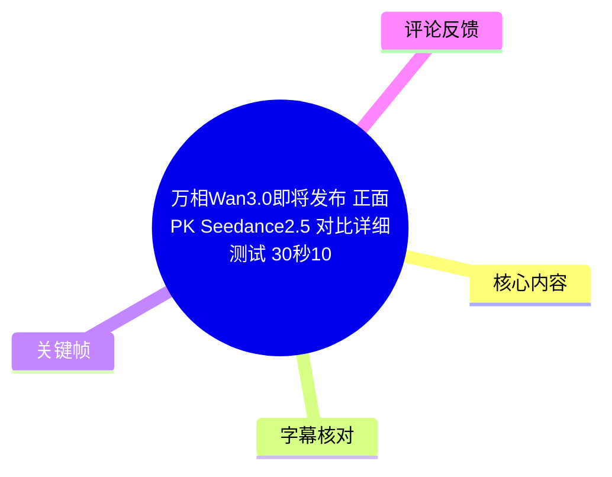
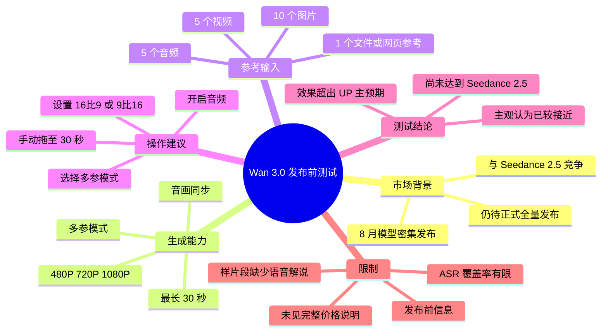
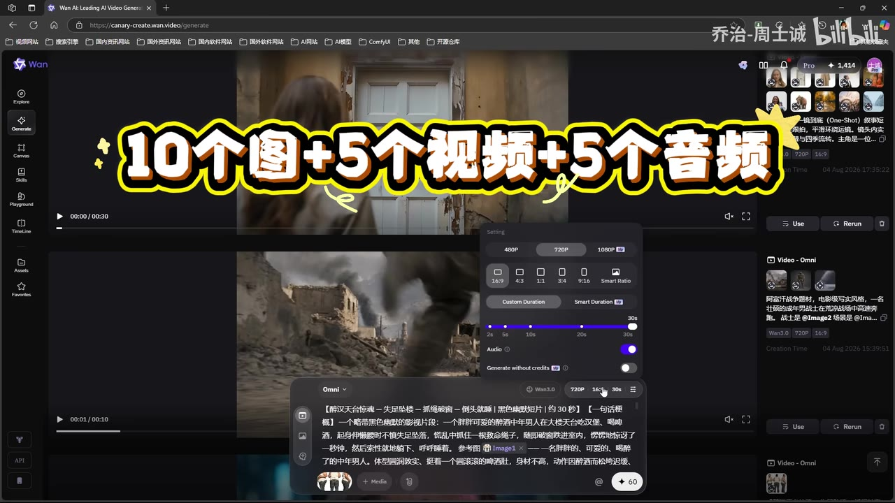
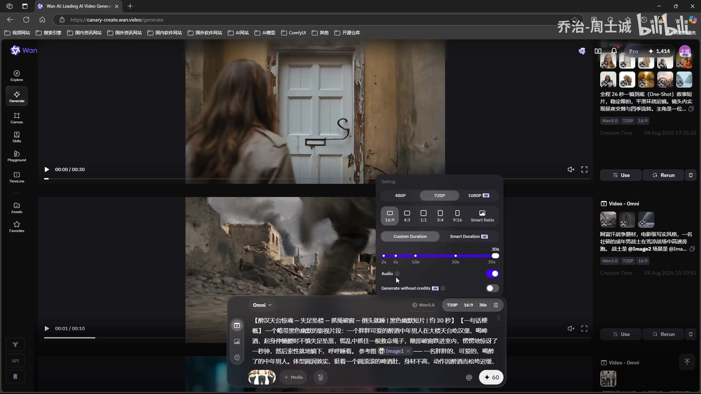

# 万相 Wan3.0 即将发布：多参考长视频能力与测试结论

> 来源：[Bilibili 视频](https://www.bilibili.com/video/BV1ATuA6BEkQ)  
> UP 主：乔治-周士诚｜时长：6 分 03 秒｜分辨率：1920×1080  
> 视频定位：围绕万相（Wan）3.0 发布前界面与样片进行的功能介绍和主观测试，与 Seedance 2.5 的能力预期进行比较。

## 小结

视频介绍的是尚未全量发布的万相 Wan 3.0。UP 主认为它选择在 Seedance 2.5 已受关注的节点推出，属于面向同类 AI 视频模型的直接竞争；同时提到 8 月是模型密集发布期，口述中还提及 “H3” 与 “Flock 3”，但这些名称存在 ASR 识别不确定性，不能据此延伸为确切产品信息。

从视频所展示的生成页设置看，Wan 3.0 的重点是**多参考输入、长时长和高分辨率输出**：可选 480P、720P、1080P，最长可拖动至 30 秒；视频明确口述并由界面大字强调，可使用 **10 个图片参考、5 个视频参考、5 个音频参考**。口述还称可添加 1 个文件参考，例如网页参考，但这项数量与具体支持格式未在截图中完整验证。

实操上，UP 主推荐优先选择最常用的“多参”模式；按成片用途手动设置横版 16:9 或竖版 9:16；若要测试长片段，则不要依赖自动时长，而应手动拖到 30 秒，并开启音画同步后生成。该流程适合需要将角色、场景、视频运动或声音素材共同作为条件输入的创作者。

测试部分以多段生成样片为主，原始语音在大部分样片段落中缺失或很少，因此不能仅凭 ASR 复原全部测试提示词、每一项对比维度和逐样片评分。可由关键帧确认，视频展示过带参考图的 3D 动画广告风格生成示例；UP 主在后段给出总体评价：Wan 3.0 **尚不能达到 Seedance 2.5 的效果，但已“很接近”**，且其表现高于自己的预期。

这是一条具有强时效性的发布前体验视频。视频使用的是“即将发布”“等平台全量发布后”的表述，界面参数、模型开放范围、价格、是否开源、额度和实际效果都可能在正式上线后变化。尤其“价格相对合理”仅是 UP 主口述判断，视频没有给出可核验的具体价格表。

## 思维导图

## 目录

- [发布背景与信息时效](#发布背景与信息时效)
- [生成页与多参考输入参数](#生成页与多参考输入参数)
- [实操设置步骤](#实操设置步骤)
- [测试样片与可确认观察](#测试样片与可确认观察)
- [与 Seedance 25 的比较结论](#与-seedance-25-的比较结论)
- [限制、适用范围与待确认事项](#限制适用范围与待确认事项)
- [字幕比对](#字幕比对)
- [评论分析](#评论分析)
- [处理记录](#处理记录)

## [发布背景与信息时效](https://www.bilibili.com/video/BV1ATuA6BEkQ?t=26)

UP 主在可用语音起点介绍，万相 3.0“也要即将发布”，并将它放在与 Seedance 2.5 正面竞争的语境中。其核心信息不是“Wan 3.0 已正式全面可用”，而是：**UP 主已接触到一个带 Wan 3.0 选项的生成界面，并预告后续全量发布。**

视频中还提出，8 月是大模型集中爆发的月份。ASR 将相关名称识别为 “H3”“2.50”“Flock 3”；其中“2.50”从标题和上下文可较高把握地对应 Seedance 2.5，而“H3”“Flock 3”的准确拼写与具体所指没有站内字幕或独立资料可校验，以下不将其当作已证实的模型名。

> 图：关键帧展示 Wan 网页端首页。输入区域右侧可见 “Wan3.0”、`720P`、`16:9`、`30s` 等界面标签，说明视频确实展示了预发布界面中的 Wan 3.0 选项；但该画面本身不能证明其最终上线策略或全部功能均已开放。

### 时效性判断

- 视频元数据所示发布时间为 2026 年 8 月 4 日，内容是当时的发布前/发布初期观察。
- UP 主使用“等平台全量发布之后”的未来时态，因此页面中的模型名称、参考上限和时长选项应视为**该视频录制时可见配置**。
- 视频描述仅提供万相官网链接：<https://tongyi.aliyun.com/wan/>，没有附带版本公告、价格页或技术白皮书。
- “能否开源”并不是视频正文给出的结论；热评中“wan3不开源”属于评论者判断，不能替代官方确认。

## [生成页与多参考输入参数](https://www.bilibili.com/video/BV1ATuA6BEkQ?t=28)

UP 主进入生成板块后，称 Wan 3.0 提供多种模式，包括：

1. **多参模式**：UP 主称其为最常用的模式，并建议一般直接选第一个。
2. **首尾帧/收尾帧相关能力**：ASR 识别为“收尾帧”，可理解为与首尾帧控制有关，但界面完整中文标签未被可靠保留，不能进一步断言其精确工作方式。
3. **参考功能**。
4. **编辑功能**。

视频最明确的能力描述是多参考输入。口述为：

| 输入类型 | 视频陈述的最高数量 | 证据情况 |
| --- | ---: | --- |
| 图片参考 | 10 个 | 口述与关键帧大字一致 |
| 视频参考 | 5 个 | 口述与关键帧大字一致 |
| 音频参考 | 5 个 | 口述与关键帧大字一致 |
| 文件参考 | 1 个 | 口述提及；截图未完整展示上限与格式 |
| 网页参考 | 作为文件参考示例 | 仅来自口述，未展示导入过程 |

> 图：关键帧中央叠加“10个图+5个视频+5个音频”，右侧设置弹窗同时可见分辨率、比例、时长与音频开关。这是正文中确认多参上限与设置位置的主要视觉依据。

### 输出与控制参数

视频口述及画面可确认的参数如下：

| 参数项 | 视频信息 | 使用含义 |
| --- | --- | --- |
| 分辨率 | 480P、720P、1080P | 生成前可选择不同清晰度档位；画面中 1080P 带有额外标记，但标记含义未被解说。 |
| 画幅比例 | 16:9、4:3、1:1、3:4、9:16、Smart Ratio 等界面选项 | UP 主建议按需求优先明确设置 16:9 或 9:16。 |
| 时长 | 可自动选择，也可自定义；最长显示/口述为 30 秒 | UP 主为长片段测试手动拉至 30 秒。 |
| 音频 | 设置面板中有 `Audio` 开关 | UP 主强调需要音画同步，画面显示音频开关处于开启状态。 |
| 生成 | 输入提示词与素材后直接生成 | 视频未提供生成耗时、队列机制或失败重试规则。 |

需注意：标题中的“30 秒 1080P 多参视频直出”与视频介绍方向一致，但**并不等于每一种输入组合、每次任务都稳定产出 30 秒 1080P 成片**。视频没有展示完整任务成功率、生成耗时、消耗额度或批量统计。

## [实操设置步骤](https://www.bilibili.com/video/BV1ATuA6BEkQ?t=52)

根据 UP 主在 00:00:51—00:01:15 的口述，以及生成页关键帧可见设置，可整理出以下实际操作顺序：

1. **进入万相生成板块**  
   在 Wan 页面从首页进入 `Generate`。UP 主称平台全量发布后，用户会在此看到 Wan 3.0 模型选项。

2. **优先选择多参模式**  
   对需要参考图、视频、音频等多条件约束的任务，选择列表中的第一个、多参模式即可。视频没有说明它与其他模式在计费或质量上的差别。

3. **准备并添加参考素材**  
   按视频公布的上限，可组合加入最多 10 张图片、5 段视频与 5 段音频。若使用文件参考，UP 主举例为网页参考；不过导入格式、文件大小、可否同时使用以及网页解析规则均未展示。

4. **选择目标分辨率**  
   在 480P、720P、1080P 之间选择。若目标是与标题相同的高规格长视频，应选择 1080P；视频未说明 1080P 是否受会员、积分、额度或灰度资格限制。

5. **明确画幅比例**  
   UP 主提醒默认尺寸“有可能是这个”，建议不要完全依赖默认值，而应根据投放渠道或内容形式设为：
   - 横版内容：`16:9`
   - 竖版内容：`9:16`

6. **设置时长**  
   界面允许自动时长或手动时长。UP 主因测试对象多为较长片段，选择自定义时长并拖到 `30s`。这是一项直接影响叙事长度和生成资源消耗的设置。

7. **打开音频并关注音画同步**  
   UP 主明确表示“这里肯定是要求它音画同步的”，并在关键帧中显示音频开关开启。视频没有展示无音频、配音替换、口型控制或音频参考优先级的对照实验。

8. **输入提示词并提交生成**  
   完成素材与属性配置后直接生成。画面能看到长文本提示词，但分辨率不足以可靠转写全文，因此不能将其编造为可复现提示词模板。

> 图：该帧清楚呈现设置浮层：480P/720P/1080P、多个比例按钮、Custom Duration/Smart Duration、最长 30 秒刻度和 Audio 开关。它补足了语音对参数位置与手动设置方式的说明。

### 可迁移的配置经验

- **先定交付形态，再填素材。** 横竖比例应在生成前按投放场景确定，避免让默认设置决定构图。
- **长视频测试优先用手动时长。** 当目标明确为 30 秒时，使用自定义时长比自动时长更符合 UP 主的测试方式。
- **多参考不等于素材越多越好。** 视频只说明容量上限，没有提供“参考数量—一致性—质量”的实验结论；实际项目应从少量关键参考开始，逐步增加。
- **将音频同步视为待验收项。** 虽然 UP 主强调音画同步，但没有展示完整的人声口型、音乐节拍或音效同步评测，应以正式版实测为准。

## [测试样片与可确认观察](https://www.bilibili.com/video/BV1ATuA6BEkQ?t=105)

约 01:27 后视频进入样片测试。可用 ASR 在 01:44—01:48 与 02:14—02:19 两次识别到相近文案：“葡萄柚咬开的是果肉，涌出来的是夏天”，但识别结果存在错字、重复与截断。这表明样片中可能带有广告式旁白或音频内容；由于没有完整站内字幕，不能据此确证样片的所有台词和比较项目。

关键帧中可较清楚确认一则视觉目标描述及其生成结果：

- 参考画面中出现沙漠、仙人掌和一只拟人化/卡通化的角蜥。
- 黄色文字描述要求是“3D 动画广告风”，并强调色彩明亮通透、果肉和汁水具有清爽冲击力、整体像高质量商业动画短片、带夸张幽默，角色可爱灵动、表情丰富。
- 该帧展示的主体是角蜥，而不是可直接辨认的葡萄柚咬开场面。因此它能够证明视频展示了“参考图 + 长文本需求”的样片工作流，但不能证明所有文字要求都在画面中逐项实现。

> 图：关键帧左下角可见参考图，主体画面为沙漠中的卡通角蜥，底部叠加了 3D 动画广告风格、明亮色彩、夸张幽默、角色灵动等要求。这张图的价值在于呈现测试的目标质量与参考图驱动方式，而非用单帧替代对完整视频运动、音画同步的评估。

### 测试信息的证据边界

| 可从素材确认 | 不能从现有素材确认 |
| --- | --- |
| 视频展示了多段生成样片 | 每段样片的完整提示词 |
| 至少存在带参考图的 3D 动画广告风测试 | 各测试是否使用相同素材、相同随机种子或相同分辨率 |
| 样片中出现与“葡萄柚”相关的短句式音频/文案 | 完整旁白文本、口型匹配准确率 |
| UP 主对整体结果给出正向评价 | 与 Seedance 2.5 的逐项客观评分、盲测与成功率 |
| Wan 界面可配置音频和最长 30 秒 | 30 秒、1080P、多参同时启用时的稳定性与耗时 |

因此，对视频中大量无语音的样片段落，应将其理解为**展示性证据**，而不是完整、可复现的基准测试报告。

## [与 Seedance 2.5 的比较结论](https://www.bilibili.com/video/BV1ATuA6BEkQ?t=343)

视频后段给出最明确的结论性判断：

> “目前看它肯定是达不到 2.5 的一个效果，但是已经很接近了。”

这里的“2.5”结合标题可对应 Seedance 2.5。该结论是 UP 主基于其大量测试后的主观评价，视频没有展示统一提示词、统一素材、统一分辨率、统一时长、评分表或第三方盲测，因此不应解读为严格意义上的模型排行榜结果。

UP 主还表示，在此前 2.5 之后自己没有再发布万相视频，原因是认为先前效果“不如不发”；但这次 Wan 3.0 “还真不错”，且“价格也相对比较合理”。这反映出其对该版本相较于其过往 Wan 使用体验的改善感受。

### 视频内比较可归纳为

| 维度 | 视频表达 | 证据强度 |
| --- | --- | --- |
| 相对质量 | Wan 3.0 接近但未达到 Seedance 2.5 | UP 主主观结论 |
| 相对预期 | Wan 3.0 高于 UP 主预期 | UP 主主观结论 |
| 相对旧版体验 | UP 主认为本次较此前 Wan 表现明显更好 | 个人历史体验，未展示旧版对照 |
| 价格 | “相对比较合理” | 无价格数字、计费单位或竞品价格，无法量化 |
| 市场意义 | 更多优秀模型竞争有利于市场 | 观点性判断 |

## [限制、适用范围与待确认事项](https://www.bilibili.com/video/BV1ATuA6BEkQ?t=343)

### 适合参考的人群

- 需要制作横版或竖版 AI 短片，并希望一次输入多类参考素材的创作者。
- 想尝试最长 30 秒、最高 1080P AI 视频生成的用户。
- 正在关注 Wan 3.0 与 Seedance 2.5 相对表现、但愿意自行复测的从业者。
- 需要将画面参考、视频参考、音频参考和文本指令组合起来的广告创意、短片预演或素材生产用户。

### 关键限制

1. **发布状态未完全确定**  
   视频明确称仍待“平台全量发布”，所以本视频不能作为当前可用功能清单或价格承诺。

2. **比较缺少可复现基准**  
   没有列出完整提示词、输入素材原文件、生成次数、随机种子、失败样本、耗时和计费信息。结论应视为体验评测而非严谨 benchmark。

3. **样片时段语音证据不足**  
   本次 ASR 语音覆盖仅约 25.38%，且有五段较大静音/无可识别语音间隔；大量内容依赖画面理解，无法补写未说出的测试条件。

4. **参数上限不代表稳定能力**  
   “10 图 + 5 视频 + 5 音频”“30 秒”“1080P”是视频中所称/所示配置能力。是否能同时启用、是否额外扣费、是否对账户层级开放、成片质量是否稳定，均待正式版本实测。

5. **未验证开源与价格**  
   视频没有给出开源许可、模型权重、API 文档、具体价格或免费额度。评论区对不开源和价格的推测不构成事实。

### 建议的后续验证清单

正式开放后，可用同一套输入素材对 Wan 3.0 与对比模型进行复测，至少记录：

- 分辨率、比例、时长、是否启用音频；
- 图片/视频/音频参考的实际数量和上传规格；
- 提示词全文及模型版本；
- 单次生成耗时、消耗额度、失败率与重试结果；
- 角色一致性、运动连续性、镜头遵循度、音画同步和文字/物体稳定性；
- 30 秒 1080P 多参考组合是否可稳定直出。

## [字幕比对](https://www.bilibili.com/video/BV1ATuA6BEkQ?t=26)

| 字幕来源 | 完整性 | 专有名词 | 时间轴 | 主要问题 |
| --- | --- | --- | --- | --- |
| Bilibili 站内字幕 | 不可用 | 无法核验 | 无法核验 | 字幕抓取工具返回失败；素材中未提供可用站内字幕。 |
| 本次 ASR 字幕 | 有效语音覆盖约 91.98 秒，占全片约 25.38% | `Wan 3.0`、`Seedance 2.5` 可结合标题和画面校正；其他名称存在不确定性 | 有真实 SRT 起止时间，可用于章节定位 | 分段文本过长且缺少标点；存在“2.50”“Flock 3”“屠性”“参抗”等误识别；样片段落大量无语音或未识别。 |

### 最终字幕选择与校正原则

本视频**没有可用站内字幕**，因此正文以本次 `large-v3-turbo` ASR 的带时间戳结果为时间定位依据，并结合关键帧与视频标题作有限校正；没有将未出现或无法辨认的信息补写为事实。

已采用的关键校正包括：

- ASR 中的“万象”按视频标题、网页端 `Wan` 标识统一写作“万相（Wan）”。
- ASR 中“2.50”按标题中的 “Seedance2.5”校正为“Seedance 2.5”。
- ASR 中“10个图片参口、5个视频参抗、5个声音参导”结合画面大字校正为“10 个图片参考、5 个视频参考、5 个音频参考”。
- “Flock 3”“H3”等名称没有足够交叉证据，保留为 ASR 不确定项，不作为正式产品事实展开。
- ASR 诊断未标记 `noAudioStream=true`；源素材提供了 `audio/audio.wav`，因此不是无音轨视频。低覆盖主要反映样片中存在较长无可识别语音区间，而非工具故障。

## [评论分析](https://www.bilibili.com/video/BV1ATuA6BEkQ?t=343)

以下仅处理可获取热评前三条，按点赞数排序。评论反映的是观众态度和市场预期，不是对产品能力、定价或开源状态的验证。

| 热评 | 点赞 | 观点概括 | 补充价值与可信度 |
| --- | ---: | --- | --- |
| `dashuhaha`：“去小孩那桌吧……需要投资老对手可灵？再说可灵现在也是在小孩那桌！” | 67 | 对 Wan 系列、阿里策略及可灵的竞争位置持明显调侃和质疑态度。 | 提示评论区对厂商竞争力与市场策略存在负面/戏谑预期；未提供数据或来源，不能据此判断模型实际质量。 |
| `众声回响0523`：“总结，wan3不开源” | 50 | 将视频概括为 Wan 3 不开源。 | 视频正文和提供的元数据均未给出开源政策；该评论是未验证断言，不能纳入事实结论。 |
| `在下胡朝`：“小孩那桌，肯定比即梦还贵” | 24 | 预测 Wan 3 定价可能高于即梦。 | 属于价格猜测。视频只称“价格相对比较合理”，未给出数字；评论与视频口述之间存在无法用现有材料解决的差异。 |

评论区的共同主题是：观众更关心 Wan 3.0 在竞品中的实际层级、商业化价格和开源状态。它们恰好也指出了本视频未充分展开的三类信息，应等待官方公告和独立实测补全。

## [处理记录](https://www.bilibili.com/video/BV1ATuA6BEkQ?t=26)

- **Worker ID**：`worker-msiy1nhz-a9a1eb29`
- **整理模型**：`gpt-5.6-terra`
- **ASR 模型**：`large-v3-turbo`，语言识别为中文，语言置信度 `0.99755859375`，运行设备为 CUDA，计算类型为 `int8_float16`。
- **使用的素材与工具产物**：视频元数据、`audio/audio.wav`、`asr/transcript.srt`、`asr/asr-result.json`、关键帧目录 `frames/`、热评文件 `comments/comments.json`。
- **字幕选择**：站内字幕抓取失败，未提供可用站内字幕；检查并采用本次 ASR 的真实 SRT 时间戳作为章节链接依据。ASR 共 9 段、语音时长约 91.98 秒、覆盖率约 25.38%，因此对无语音样片段落只做画面可确认描述。
- **关键帧选择依据**：
  - `frames/frame-001.jpg`：用于确认 Wan 网页端与 Wan 3.0、720P、16:9、30s 等可见标签；
  - `frames/frame-002.jpg`：用于确认“10 图 + 5 视频 + 5 音频”及多参生成设置；
  - `frames/frame-003.jpg`：用于确认分辨率、比例、时长、音频开关的具体界面位置；
  - `frames/frame-004.jpg`：用于说明样片测试采用参考图与 3D 动画广告风格目标。
- **缓存清理**：提供的素材清单未包含缓存清理执行日志，无法确认是否执行或其结果；本记录不虚构清理状态。
- **未解决问题**：Wan 3.0 正式上线日期、开放范围、价格与额度、是否开源、文件/网页参考的具体规则、1080P 30 秒多参组合的稳定性，以及对 Seedance 2.5 的可复现逐项对比数据，均未在现有素材中得到完整证实。

## 评论分析

- 热评 1：去小孩那桌吧，以阿里的尿性，wan系列和欢乐马牛逼硬气的话 需要投资老对手可灵？ 再说可灵现在也是在小孩那桌！
- 热评 2：总结，wan3不开源
- 热评 3：小孩那桌，肯定比即梦还贵

以上内容是观众反馈摘录，只用于补充理解视频反响，不作为正文事实依据。
