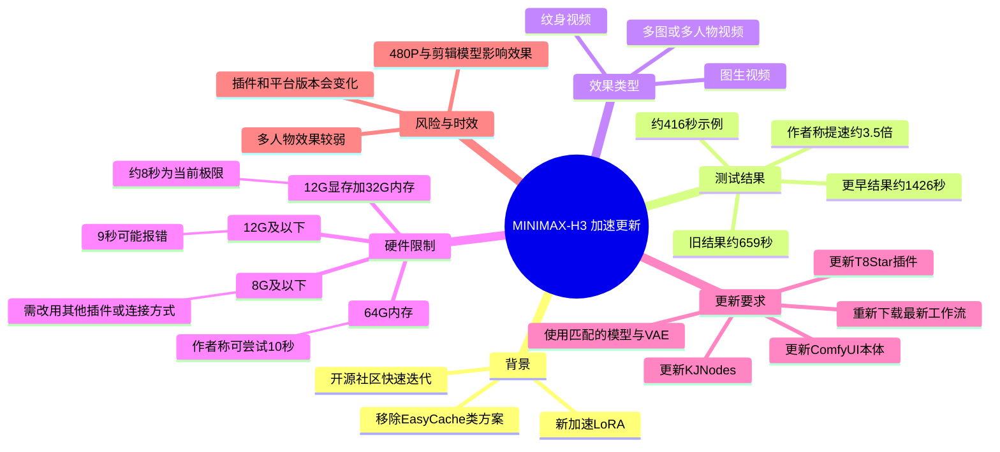
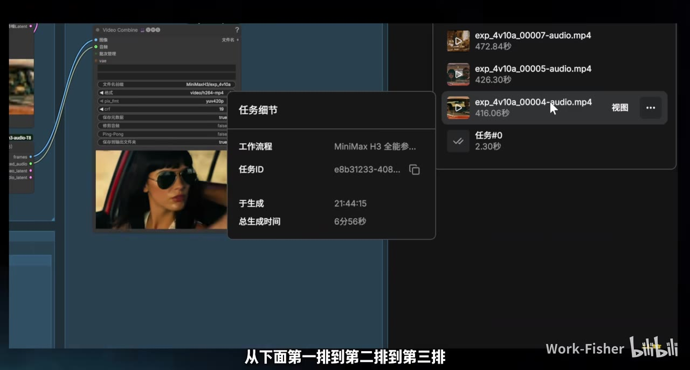
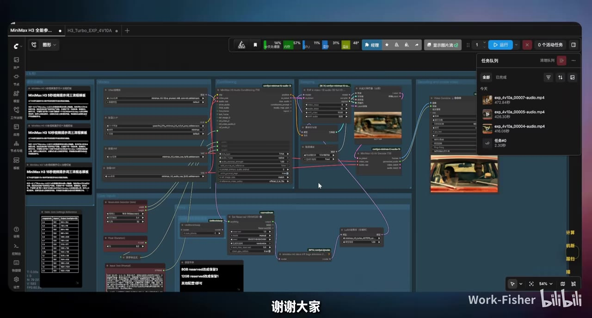
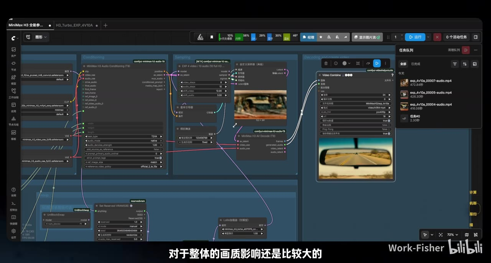
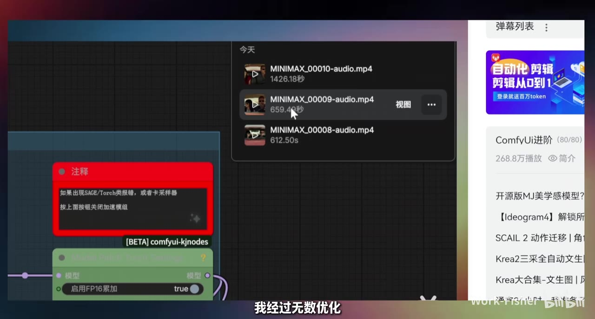

# 【MINIMAX-H3】再次提速350％ | 12G显存 10秒只需450秒！！！！！

> 来源：[Bilibili 视频](https://www.bilibili.com/video/BV1fMuH6UEH9) 
> UP 主：Work-Fisher | 视频时长：377 秒 | 采集到的音频时长：376.277 秒

## 小结

视频介绍了 MINIMAX-H3 工作流的一次加速更新：作者使用新发布的加速 LoRA，并移除此前会明显影响画质的 EasyCache 类方案，展示了纹身视频、图生视频和多图／多人物视频的测试结果。

作者在视频中给出的代表性测试是：此前一次运行约 659 秒，早期结果曾达到约 1426 秒；本次测试约 416 秒，作者据此称整体提速约 3.5 倍。关键帧中的任务列表显示了 416.06 秒、426.30 秒和 472.84 秒等任务耗时，但这些是视频画面中的示例，不应理解为所有设备和所有工作流都能达到的固定速度。

显存与内存限制是本期最重要的实践信息：作者以 12G 显存、32G 内存进行测试时，当前约 8 秒是极限；12G 及以下显存尝试生成 9 秒可能报错。若内存达到 64G，作者表示 10 秒通常可以运行。8G 或更低显存不能使用本期加速插件，需要改用上一期介绍的连接方式，但速度会明显下降。

视频还说明了插件和工作流的更新关系：T8Star 的 MINIMAX 专用插件、KJNodes 以及相关特化工作流需要更新；RunningHub 端的工作流已经更新，但插件发布存在延迟，作者表示会在插件更新后继续同步。

本笔记适合准备在 ComfyUI 中运行 MINIMAX-H3、关注低显存部署和视频生成速度优化的用户。视频中的插件、模型和平台链接具有明显时效性，使用前应以作者简介、GitHub 仓库和 RunningHub 当前版本为准。

## 思维导图

## 目录

- [背景与提速结果](#背景与提速结果)
- [三类生成效果与画质判断](#三类生成效果与画质判断)
- [插件、工作流与模型更新](#插件工作流与模型更新)
- [显存、内存与时长限制](#显存内存与时长限制)
- [本地与云端资源](#本地与云端资源)
- [可复用的实践步骤](#可复用的实践步骤)
- [结论与限制](#结论与限制)
- [字幕比对](#字幕比对)
- [评论分析](#评论分析)
- [处理记录](#处理记录)

## 背景与提速结果 [00:31](https://www.bilibili.com/video/BV1fMuH6UEH9?t=31)

作者在约 31.48 秒开始介绍本次 MINIMAX-H3 更新，核心变化包括：

1. 加入新的加速 LoRA。
2. 配合新的使用方式。
3. 取消或移除此前会削弱画质的 EasyCache 类方案。
4. 通过新的插件、LoRA 和工作流组合提高生成速度。

视频中给出的速度对比为：

| 测试阶段 | 视频中提到的耗时 | 说明 |
| --- | ---: | --- |
| 更早的结果 | 约 1426 秒 | 作者提到的旧测试结果 |
| 上一期或此前优化结果 | 约 659 秒 | 作者称经过多次优化，但效果仍不如本次 |
| 本次示例 | 约 416 秒 | 作者据此称相对旧结果提速约 3.5 倍 |
| 关键帧任务示例 | 416.06 秒、426.30 秒、472.84 秒 | 画面中任务列表显示的多个任务耗时 |

> 图：该关键帧展示了 ComfyUI／任务列表中的多个输出任务，其中一个任务显示约 416.06 秒，另外还可见约 426.30 秒和 472.84 秒。它直接保留了视频中“约 400 多秒”速度说法的画面证据，但不能据此推导其他硬件上的固定速度。

作者将“约 659 秒到约 416 秒”以及更早的“约 1426 秒到约 400 多秒”概括为约 3.5 倍提速。这里的“350％”是视频标题和作者的概括性表达；素材没有提供统一的分辨率、步数、采样器、CPU／GPU 型号等完整基准条件，因此不能将该倍率视为标准化 benchmark。

## 三类生成效果与画质判断 [01:11](https://www.bilibili.com/video/BV1fMuH6UEH9?t=71)

### 纹身视频 [01:11](https://www.bilibili.com/video/BV1fMuH6UEH9?t=71)

作者首先展示纹身视频效果，并认为本次结果比此前使用 EasyCache 时更好。

作者对 EasyCache 的解释是：理论上会从一个包含约 50 层的大模型处理中直接跳转部分过程。这样虽然可以加快生成，但可能降低精度，从而影响整体画质。本次方案取消了相关处理，改用新的加速 LoRA 和插件组合，因此作者认为画质损失较小，甚至优于此前方案。

这里的“效果更好”是视频作者基于展示结果作出的判断，并非素材中经过统一客观指标测量的结论。

### 图生视频 [01:47](https://www.bilibili.com/video/BV1fMuH6UEH9?t=107)

视频随后展示图生视频。作者说明，图生视频中的人物或画面主体来源于输入图片，并表示相较对应测试，生成时间只增加约 10 秒，但质量仍然“不错”。

素材没有提供该输入图的具体分辨率、提示词、采样步数、种子或完整参数，因此只能记录作者的流程和观察，不能复现出完全相同的结果。

### 多图／多人物视频 [02:02](https://www.bilibili.com/video/BV1fMuH6UEH9?t=122)

作者对多图、多人物场景持保留态度：

- 多人物场景通常更容易出现效果变差。
- 本次测试结果不算理想，但作者认为问题主要来自 MINIMAX-H3 本身的多图／多人物能力，而不完全是本次加速流程造成的。
- 本次测试使用了 480P。
- 使用的还是经过剪辑的一个大模型版本，因此结果需要结合这些条件理解。
- 作者认为在这些限制下，当前效果仍然可以接受。

> 图：关键帧展示了完整工作流、模型节点、采样节点、解码与视频合并区域，以及右侧任务队列和输出预览。它有助于理解视频讨论的不是单一模型文件，而是由模型、LoRA、插件节点和视频输出节点共同组成的工作流。

## 插件、工作流与模型更新 [02:28](https://www.bilibili.com/video/BV1fMuH6UEH9?t=148)

### T8Star 插件与加速 LoRA [02:52](https://www.bilibili.com/video/BV1fMuH6UEH9?t=172)

作者将本次插件和 LoRA 的主要贡献归功于 T8Star，并表示相关工具是刚刚发布的。视频建议用户关注作者简介中的 GitHub 链接并为项目点 Star。

素材元数据中提供的插件地址为：

- [comfyui-minimax-h3-audio-T8 GitHub](https://github.com/T8mars/comfyui-minimax-h3-audio-T8/tree/main)

视频没有在文本素材中给出完整安装命令、具体提交版本或兼容性矩阵，因此不能补充未出现的安装细节。

### RunningHub 工作流更新 [03:16](https://www.bilibili.com/video/BV1fMuH6UEH9?t=196)

作者说明：

- RunningHub 侧的工作流已经更新。
- 插件当时尚未同步更新。
- 作者预计 RunningHub 通常会在之后更新插件；视频中提到“明天”可能完成更新。
- 作者已经放上了 CG adaptation、KJ 版本的 MINIMAX 特化版以及 LoRA。
- 本期主要增加加速内容，具体插件在当时尚未全部上线。

由于“明天”是视频发布时的相对时间，现阶段不能把它当作当前状态。使用者应直接检查 RunningHub 页面和作者最新说明。

### KJNodes 与 T8Star 更新 [04:52](https://www.bilibili.com/video/BV1fMuH6UEH9?t=292)

视频后段再次强调插件更新：

- 主要新增或使用 T8Star 的 MINIMAX 专用插件。
- KJNodes 已更新，用于支持作者所说的最新 MINIMAX CGR 推讯／推训相关节点或流程。
- 其他插件没有明显变化。
- 用户至少需要更新 T8Star 专用插件和 KJNodes。

> 图：关键帧可以看到工作流中从模型加载、条件输入、采样、LoRA、VAE／解码到 Video Combine 的连接关系，适合用来定位“插件更新”在整个流程中的作用范围。

### 模型与 VAE 匹配 [05:16](https://www.bilibili.com/video/BV1fMuH6UEH9?t=316)

作者提醒模型版本必须匹配：

- 视频中 ASR 将目标名称识别为“FKETO 的 FL2VA”模型，原始语音存在明显专有名词识别不确定性。
- 作者明确表示不能继续使用此前的“全能参考”模型。
- 原因是两者训练级别不同，混用可能导致画质“裂化”。
- 作者测试使用的模型大小约为 19.5，认为当前效果不错并建议尝试。

由于素材没有提供该模型的准确文件名、下载地址或画面中完整可读的节点名称，本文保留 ASR 的不确定转写，不将其擅自校正为其他模型名称。

## 显存、内存与时长限制 [03:16](https://www.bilibili.com/video/BV1fMuH6UEH9?t=196)

视频给出的硬件和时长经验如下：

| 硬件条件 | 视频中的建议或结果 |
| --- | --- |
| 12G 显存、32G 内存 | 作者测试时约 8 秒是当前极限 |
| 12G 及以下显存 | 只能重点考虑约 8～9 秒；作者实测 9 秒会报错 |
| 12G 显存、64G 内存 | 作者表示 10 秒通常可以运行 |
| 8G 显存或更低 | 不能使用本期这一加速插件，需要更换方案 |
| 8G 显存生成约 5 秒 | 按作者所说通常不需要改用另一种连接方式 |
| 8G 显存生成约 8～10 秒 | 可以采用上一期提到的重新连接设置，但速度会明显变慢，可能达到约 600 秒 |

需要特别区分两类信息：

1. **作者实际测试条件**：12G 显存、32G 内存，约 8 秒为极限。
2. **作者对其他条件的判断**：64G 内存可能支持 10 秒，8G 显存需要另一种设置。

这些数值不是硬性兼容性标准。实际速度和能否运行还会受到视频分辨率、模型版本、LoRA、采样步数、节点实现、系统内存、虚拟内存和 ComfyUI 版本等因素影响；视频没有完整列出这些参数。

> 图：该关键帧同时展示了此前任务耗时列表和工作流中的设置节点，画面中可见作者用于说明旧结果、优化过程及显存设置的界面。它适合辅助理解“速度提升”和“低显存替代方案”之间的关系。

## 本地与云端资源 [02:52](https://www.bilibili.com/video/BV1fMuH6UEH9?t=172)

视频元数据描述中列出了以下资源：

### 云端版本

- 国内版工作流：[RunningHub 国内版工作流合集](https://www.runninghub.cn/post/2084259935344480258/?inviteCode=rh-v1270)
- 国外版审核版：[RunningHub 海外版工作流](https://www.runninghub.ai/post/2084161797220855809/?inviteCode=rh-v1270)

### 本地版本

- 工作流及模型下载：[夸克网盘资源](https://pan.quark.cn/s/bfffb2e76ef4dfb2e76df4)

### 入门与整合包

- 新手基础入门教程：[Bilibili BV1vEBuB1EzZ](https://www.bilibili.com/video/BV1vEBuB1EzZ)
- 完整基础整合包：[夸克网盘](https://pan.quark.cn/s/5a0d461d4feb)
- 纯净整合包：[夸克网盘](https://pan.quark.cn/s/4ceb1bcb65ef)
- 配套模型库：[夸克网盘](https://pan.quark.cn/s/1f4adede5f3a)

元数据还特别要求使用前将 ComfyUI 本体更新到最新版本。以上链接和版本均可能随时间变化，下载前应检查作者最新发布内容。

## 可复用的实践步骤 [03:16](https://www.bilibili.com/video/BV1fMuH6UEH9?t=196)

以下步骤按照视频实际讲述内容整理；视频没有提供完整逐节点安装教程，因此不补写未出现的命令或参数。

1. **更新 ComfyUI 本体**  
   使用前先将 ComfyUI 更新到最新版本，这是视频简介中的明确要求。

2. **重新下载最新工作流**  
   作者表示工作流已重新更新，建议不要继续使用旧视频或旧版本中保存的工作流。

3. **更新 T8Star 的 MINIMAX 专用插件**  
   本次加速 LoRA 和工具依赖该方向的最新发布内容。插件当时可能存在平台同步延迟，应以 GitHub 或 RunningHub 当前版本为准。

4. **更新 KJNodes**  
   作者表示 KJNodes 已更新，以支持最新的 MINIMAX 相关 CGR 流程或节点。

5. **加载匹配的模型与 LoRA**  
   使用本期对应的 MINIMAX 特化模型和新加速 LoRA，不要将视频所说的新模型与此前“全能参考”模型混用。

6. **按显存选择视频时长**  
   - 12G 显存、32G 内存：优先从约 8 秒开始测试。
   - 12G 及以下显存：不要直接假设 9 秒可用；作者实测 9 秒报错。
   - 64G 内存：可以尝试 10 秒，但仍需以实际运行情况为准。
   - 8G 或更低显存：切换到上一期提到的低显存连接方案。
   - 8G 显存生成 5 秒：通常不需要切换该方案。
   - 8G 显存生成 8～10 秒：可以切换，但作者称速度可能下降到约 600 秒。

7. **先验证单人或单图场景**  
   视频展示中，纹身视频和图生视频的效果相对积极。多图、多人物场景本身更容易变差，应降低预期。

8. **检查输出画质和字幕问题**  
   视频主要讨论速度和画质，没有提供系统化的字幕关闭方法。热评中有用户反馈生成结果容易带字幕，因此实际使用时还应单独检查输出是否出现不需要的字幕。

## 结论与限制 [06:05](https://www.bilibili.com/video/BV1fMuH6UEH9?t=365)

### 可迁移经验

- 新模型发布初期，先优化速度和可产出性，再研究更多玩法，是作者总结的实际工作节奏。
- 速度提升不应只看单次耗时，还要同时比较画质、显存占用、视频时长和失败率。
- EasyCache 类跳步方案可能带来速度收益，但也可能损害精度；本期方案试图通过新的加速 LoRA 减少这种影响。
- 工作流、节点插件、LoRA 和主模型必须视为一个整体，不能只更新其中一个组件后就默认兼容。

### 已知限制

- 约 416 秒、3.5 倍提速等数字来自视频作者的测试和归纳，不是完整可复现的统一基准。
- 视频没有给出全部硬件型号、分辨率、步数、采样器、种子和提示词。
- 多图／多人物能力本身较弱，视频中的测试还使用了 480P 和经过剪辑的大模型。
- 12G 显存配 32G 内存时，作者当前测试约 8 秒为极限；9 秒已出现报错。
- 8G 或更低显存需要替代插件或连接方案，且生成速度可能降到约 600 秒。
- 模型名称“FKETO 的 FL2VA”等由 ASR 识别，专有名词存在误识别可能；应以视频画面和实际下载文件名核对。
- RunningHub、GitHub 插件、模型下载包和 ComfyUI 版本都具有时效性，视频中的“明天更新”不能视为当前状态。
- 视频没有验证热评中其他用户的硬件和速度，也没有提供关闭自动字幕的正式方案。

## 字幕比对 [00:31](https://www.bilibili.com/video/BV1fMuH6UEH9?t=31)

本次已检查站内字幕和 ASR。源素材中的 `asr-result.json` 没有标记 `noAudioStream=true`；ASR 识别到了中文音轨，使用模型为 `large-v3-turbo`，语言概率为 `0.99755859375`，音频时长约 376.277 秒。

| 字幕来源 | 完整性 | 专有名词 | 时间轴 | 主要问题 |
| --- | --- | --- | --- | --- |
| Bilibili 站内字幕 `p01-ai-zh.srt` | 很不完整 | 无有效口播专有名词 | 有真实分段时间，但主要覆盖 00:00:00.040～00:01:33.340 | 几乎全部内容被标为“音乐”，仅在约 1:24 出现“啦”等短文本，不能用于整理口播 |
| 本次 ASR 字幕 `asr/transcript.srt` | 覆盖主要口播 | 有大量误识别和同音词问题 | 完整覆盖 00:00:31.480～00:06:16.240 | “LoRA、EasyCache、KJNodes、RunningHub、ComfyUI、VAE”等词部分识别不稳定，长句缺少标点 |

ASR 诊断信息：

- 识别语言：中文。
- 语音覆盖率：约 85.77%。
- 语音段数：17。
- 首段口播：31.48 秒。
- 末段口播：376.24 秒。
- 最大间隔：114.60～122.70 秒，约 8.1 秒。
- 未发现 `noAudioStream=true`，因此本次不是无音轨视频。

### 字幕采用策略

正文以本次 ASR 的真实起止时间为主要时间轴依据，因为站内字幕没有提供有效口播文本。站内字幕仍被检查并记录，但仅能说明视频开头和部分区间被标注为音乐，不能替代 ASR。

对 ASR 中可能存在误识别的内容，采用以下方式处理：

- 保留可以由上下文确认的名称，如 MINIMAX-H3、LoRA、EasyCache、ComfyUI、RunningHub、T8Star、KJNodes。
- 对“多餐／多餸”等明显识别异常，结合上下文统一表述为“多图／多人物”或“多图场景”，并标注为语义整理。
- 对“FKETO 的 FL2VA”“CGR 推讯／推训”等无法从文本完全确认的专有名词，不强行改写成未经素材证实的名称。
- 速度、显存、内存、时长和模型大小等数字均保留视频或 ASR 中出现的数值，并注明其属于作者测试条件。

## 评论分析 [00:00](https://www.bilibili.com/video/BV1fMuH6UEH9?t=0)

素材中实际获取到 2 条热评，未提供第三条，因此仅分析可获取内容。

### 1. TL同乐：补充另一套硬件与速度测试

评论内容称其使用：

- RTX 5080
- 48G 内存与最多 96G 虚拟内存
- PyTorch 2.10.0
- CUDA 13.0
- SageAttention 2.2.0
- 双时钟采样 8 步

该用户还声称，生成 10 秒视频时：

- 864 × 480、比例标为 0.4：约 120～140 秒。
- 1152 × 640、比例标为 0.7：约 250～300 秒。

**分析：**这条评论提供了有价值的对照条件，说明不同 GPU、软件栈、采样设置和分辨率可能使速度显著快于视频作者的测试。但评论没有提供完整工作流、模型版本、LoRA 权重、批量设置和其他节点配置，不能直接与视频中的约 416 秒结果作严格横向比较。上述速度属于评论者自述，未被本素材进一步验证。

### 2. 忘笙夫子：反馈输出经常出现字幕

评论称生成结果经常自动出现字幕，虽然字幕文字基本正确，但对不需要字幕的用户而言会增加剪辑难度。

**分析：**这补充了视频正文没有展开的实际使用问题：视频生成模型可能在画面中生成文字或字幕样内容。评论没有说明是提示词、输入素材、模型固有倾向还是后处理造成，也没有给出关闭方法，因此只能作为待排查现象，不能视为已确认的插件缺陷。

## 处理记录 [00:00](https://www.bilibili.com/video/BV1fMuH6UEH9?t=0)

- Worker ID：`worker-msiy1ula-e838bb9a`
- 调用工具与模型：本次 ASR 使用 `large-v3-turbo`；知识整理模型为 `gpt-5.6-terra`
- ASR 设备与计算类型：CUDA，`int8_float16`
- 使用的应用工具：站内元数据、站内时间轴字幕 `p01-ai-zh.srt`、本次 ASR 结果与 SRT、关键帧、热评 JSON
- 字幕选择：已检查站内字幕和本次 ASR；站内字幕主要为“音乐”标记且缺失口播，因此正文采用带时间戳的 ASR，并用上下文对明显同音误识别作谨慎语义整理
- 关键帧选择依据：选用 `frames/frame-001.jpg` 展示约 416.06 秒、426.30 秒和 472.84 秒的任务列表；选用 `frames/frame-002.jpg` 展示旧任务耗时和工作流设置；选用 `frames/frame-003.jpg` 展示完整 ComfyUI 工作流与输出；选用 `frames/frame-004.jpg` 展示模型、LoRA、采样、解码和 Video Combine 节点连接关系
- 关键帧路径：`frames/frame-001.jpg`、`frames/frame-002.jpg`、`frames/frame-003.jpg`、`frames/frame-004.jpg`
- 缓存清理：素材处理记录未提供独立的缓存清理结果，不能确认已执行清理
- 未解决问题：站内字幕未覆盖有效口播；部分模型、节点和插件专有名词存在 ASR 误识别；视频未提供完整复现参数；未获取第三条热评；无法仅凭现有素材确认插件当前版本及自动字幕问题的解决方式

## 评论分析

- 热评 1：RTX 5080 48g内存+最大96g虚拟内存 PyTorch 2.10.0 + CUDA 13.0 SageAttention 2.2.0（cu130 + torch2.10） 在用双时钟采样8步这个工作流，生成10秒视频的情况下，864 x 480(0.4) 视频大约120-140s，1152 x 640(0.7)的视频大约250s-300s，加速效果明显，视频质量也不错[洛天依_爱你] 感谢up分享[洛天依_goodjob]
- 热评 2：还有个问题，它老爱出字幕，当然字幕的字到是正确的，但我不需要啊。[笑哭]，有字幕的时候要剪辑就挺尴尬的。

以上内容是观众反馈摘录，只用于补充理解视频反响，不作为正文事实依据。
